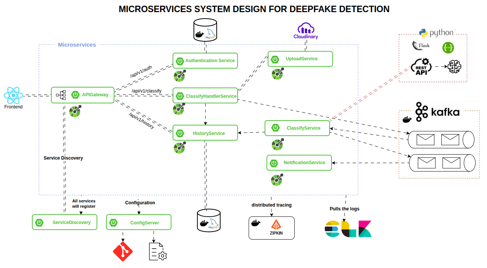

# 🧠 Microservices System Design for Deepfake Detection

  
  
  
  
  
  
  
  
  
  
  

## 📌 Project Description

This project showcases a cloud-native, microservices-based architecture for detecting **deepfakes** in uploaded media using a scalable and modular approach. The system is built with modern technologies such as **Spring Boot**, **React**, **Kafka**, **Python (Flask)**, **Cloudinary**, **MySQL**, and **Docker**.

## 📸 System Architecture
  

## 🧱 Microservice Modules Breakdown

### 🖥️ Frontend

* Built using **React.js**
* Connects with backend via API Gateway

### 🧭 API Gateway

Handles all client requests and routes them to the appropriate service.

* ` /api/v1/auth`
* ` /api/v1/classify`
* ` /api/v1/history`

### 🔐 Authentication Service

* Manages user login/signup
* Uses **MySQL** for credential storage

### ☁️ Upload Service

* Handles image/video uploads to **Cloudinary**

### 🧪 Classify Handler Service

* Coordinates:

  * Media upload
  * Deepfake analysis
  * Notification sending
  * History logging

### 🧠 Classify Service

* Implements AI model in **Python + Flask**
* REST-based deepfake detection
* Publishes results via **Kafka**

### 🔔 Notification Service

* Sends alerts (email, SMS, push)
* Kafka consumer

### 🕒 History Service

* Saves user action and classification logs in **MySQL**
* Supports history retrieval via API

### 🧭 Service Discovery (Eureka)

* Registers all services dynamically for load balancing and discovery

### 🧾 Config Server

* Centralized configuration system using **Spring Cloud Config**
* Syncs with a **Git-based** configuration repo

### 📊 Observability Stack

* **Zipkin** for distributed tracing
* **ELK Stack** (Elasticsearch + Logstash + Kibana) for logging and analysis

## ⚙️ Tech Stack Overview

| Category          | Technology                |
| ----------------- | ------------------------- |
| Frontend          | React.js                  |
| Microservices     | Spring Boot (Java)        |
| AI Service        | Python + Flask            |
| Storage           | Cloudinary                |
| Messaging Queue   | Apache Kafka              |
| Database          | MySQL                     |
| Configuration     | Spring Cloud Config + Git |
| Service Discovery | Eureka                    |
| Tracing           | Zipkin                    |
| Logging           | ELK Stack                 |
| Containerization  | Docker                    |
